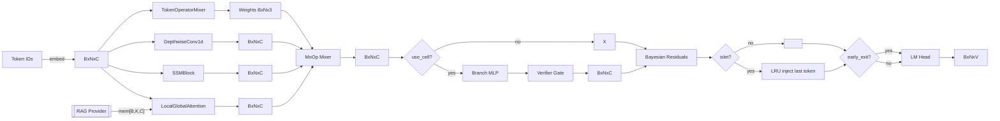
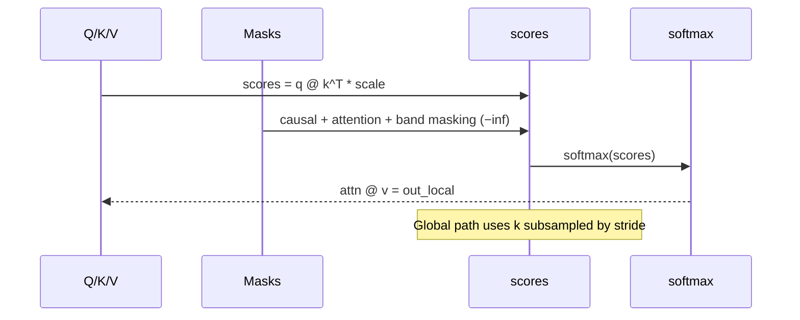

# Oumnix Minimal – System Architecture (Lab‑Level Technical Reference)

This document provides a rigorous, implementation‑accurate description of the Oumnix Minimal repository. It focuses on formal interfaces, shapes, masks, numerical stability, error contracts, complexity, runtime flags, and performance instrumentation. Use it as a blueprint for development, review, and advanced experimentation.

Contents
- 1) Design Principles and Invariants
- 2) Repository Map and Responsibilities
- 3) Core Modeling
- 4) Agent Wrapper and Metacognition
- 5) Memory and Retrieval
- 6) Losses, Metrics, and Instrumentation
- 7) Tokenizer and Dataset Loader
- 8) User Interfaces and Sampling Semantics
- 9) Training Pipelines and Scheduling
- 10) Precision, Determinism, and Numerical Notes
- 11) Flags, Envs, Defaults Matrix
- 12) Complexity and Performance Guidelines
- 13) Testing Strategy and Invariants
- 14) CI, Security, and Release
- 15) Troubleshooting and Error Contracts
- 16) Extensibility Pathways
- Appendix A) Shape Tables by Stage
- Appendix B) Mermaid Diagrams (Dataflow)
- Appendix C) Performance Counters and Benchmark Guidance

## 1) Design Principles and Invariants
- Non‑Transformer architecture built around modular operator mixing (attention/SSM/conv) and embedded retrieval.
- Default runtime is deterministic and conservative; advanced features are opt‑in via flags.
- Masking must be causally correct and shape‑robust when RAG appends memory vectors.
- Code paths remain numerically stable; masking uses −inf sentinel before softmax.
- Tests assert causality, parity under flag toggles, finiteness of loss, defaults, and UI persistence.

Invariants
- No future leakage: j ≤ i enforced for all attention score tensors.
- RAG augmentation must not alter output sequence length; final output always [B,N,C].
- Default flags do not change baseline behavior.

## 2) Repository Map and Responsibilities
- core/
  - model.py: LocalGlobalAttention, SSMBlock, LoRA, WeaveLinear, DepthwiseConv1d, TokenOperatorMixer, OumnixSimpleAI
  - oumnix_ai.py: Agent wrapper, config, activation, persistence hooks
  - analogy_engine.py, causal_engine.py, metacognition.py: metacognitive scaffolds
  - loss.py: free‑energy loss
  - fp8_optimization.py: FP8 switches
- memory/
  - episodic.py: FAISS episodic memory (L2/IP) with persistence
  - short_term.py: short‑term token/embedding buffer
  - consolidator.py: EWC scaffold
  - infinity_window.py, persistence.py: extended memory and state scaffolds
- utils/
  - tokenizer.py, dataset.py, rag_provider.py, metrics.py, logging_utils.py, seeds.py
- ui/
  - cli.py, web.py, advanced_cli.py, advanced_web.py
- training entrypoints: train.py, train_simple.py, train_streaming.py
- tests/: attention, flags, memory, UI, performance, logging envs

## 3) Core Modeling

### 3.1 LocalGlobalAttention
Causal local attention with banded window and global subsampling; optionally fuses retrieval vectors  as pseudo K/V.

Interfaces
- __init__(dim: int, heads: int = 8, local_window: int = 64, dropout: float = 0.0, use_rag: bool = False, rag_topk: int = 8, enable_token_flow: bool = False, token_flow_thresh: float = 0.0)
- set_rag_provider(provider: Callable[[Tensor[B,N,C]], Optional[Tensor[B,K,C]]])
- forward(x: Tensor[B,N,C], mask: Optional[Tensor[B,N]]) -> Tensor[B,N,C]

Numerics and masks
- H=heads, Dh=C/H, scale=Dh^(−1/2)
- scores = q @ k^T; masked with: causal, optional attention mask, local band mask
- scores_global = q @ k_global^T; masked to valid region (shape‑aligned causal mask of ones is acceptable since global keys are subsampled past tokens only)
- Token flow: compute attn_local=softmax(scores_local), derive per‑token maximum probability averaged over heads; if below threshold, zero corresponding V values

RAG fusion
- Provider returns mem[B,K,C]; mem is projected to mk,mv and concatenated along N axis of K/V; mask is extended with ones for K extra positions
- If provider returns None, incompatible batch/feature shapes, or wrong dims, augmentation is skipped

Return and shape guarantee
- out_local + out_global reshaped back to [B,N,C] regardless of K

Error contracts
- No explicit exception is raised by attention on provider shape; incompatible mem is ignored
- Mask dimension mismatch is avoided by deriving masks from scores sizes at runtime

### 3.2 SSMBlock
- Parameters A[C,d_state], D[d_state,C]
- forward: y = cumsum(x@A, dim=time) @ D; returns [B,N,C]

### 3.3 LoRALayer
- base forward plus scaled low‑rank residual x @ A @ B

### 3.4 WeaveLinear
- post‑base per‑feature gate y*g, g in (0,1)

### 3.5 DepthwiseConv1d
- groups=dim depthwise temporal convolution, kernel 3, padding 1

### 3.6 TokenOperatorMixer
- proj(x)→[B,N,n_ops]; weights=softmax(proj/temperature)
- last_entropy stores mean per‑token entropy for diagnostics

### 3.7 OumnixSimpleAI
- Embedding → N blocks of attention, SSM, optional MoOp (adds depthwise conv), optional Cell branch, residual noise, islet injection, early‑exit → LM head

Flags and behaviors
- use_moop: enables 3‑operator mixing per token
- use_cell: branch MLP + verifier gate; mix branch into x conditioned on threshold
- use_bayesian_residuals: training‑only noise; optional residual_stochastic with residual_prob for sampling per block
- use_islet_injection: LRU keyed by last‑two token ids; injects saved vector into last token representation
- early_exit: returns logits early when entropy < threshold

## 4) Agent Wrapper and Metacognition (core/oumnix_ai.py)
- OumnixAIConfig: dimensions, heads, memory knobs, neurochemistry toggles, persistence and consolidation intervals
- create_oumnix_ai: builds model, wires metacognition/neurochemistry and persistence; exposes lifecycle control
- Scaffolds: analogy_engine, causal_engine, metacognition for research hooks

## 5) Memory and Retrieval

### 5.1 EpisodicMemory (memory/episodic.py)
- metric in {"l2","ip"}; normalize=True performs L2 normalization
- add(vectors[n,dim], texts[n]) raises ValueError on shape mismatch or length mismatch
- search(query[dim], k) validates dim; returns up to k (text,dist) pairs
- save(dir) writes index.faiss, meta.json, vectors.npy (optional raw vectors)
- load(dir) validates files; raises FileNotFoundError when missing

### 5.2 SimpleRagProvider (utils/rag_provider.py)
- update_with_sequence_embed(seq_embed[C]): raises ValueError on wrong dimensionality
- __call__(x[B,N,C]) returns mem[B,K,C] if memory populated; None if empty

### 5.3 ShortTermBuffer
- add(ids, embeds) trims from left to capacity; get() returns concatenated ids and embeds or empty tensors

### 5.4 Consolidator
- compute_fisher(dataloader) accumulates grad^2 as fisher proxy; ewc_loss() returns weighted penalty

## 6) Losses, Metrics, Instrumentation

### Free‑Energy Loss
- CE minus small Gaussian entropy term over σ; clamps to avoid log(0); finite on CPU/GPU

### PerfTracker
- Rolling tokens/s, ms/token, VRAM, and placeholders for KV hit/head drops; snapshot queries torch.cuda when available

## 7) Tokenizer and Dataset
- Regex tokenization capturing ellipses and punctuation adjacency; versioned vocab pickle
- TextLineDataset robustly parses JSON lines (text/content keys), lists of strings or dicts, and plain text lines; returns torch.long id tensors

## 8) User Interfaces and Sampling

CLI
- Multinomial sampling with temperature and optional top‑k
- Env: OUMNIX_TEMPERATURE, OUMNIX_TOPK, OUMNIX_MAX_NEW_TOKENS, OUMNIX_USE_RAG, OUMNIX_STOP_SEQUENCES, OUMNIX_METRICS_INTERVAL
- Computes surprise on emitted token; optional RAG memory update with sequence mean

Web
- make_interface chat; make_interface_with_controls with sliders persisted to .oumnix_web_settings.json; toggled by OUMNIX_WEB_CONTROLS=1

Logging
- OUMNIX_LOG_LEVEL controls root logger level applied by logging_utils.get_logger

## 9) Training Pipelines and Scheduling

train.py
- collate_fn: pad to batch max, mask synthesis; returns ids, targets, masks
- compute_loss: masked CE over shifted logits; supports EWC penalty if present
- evaluate: validation over DataLoader
- Scheduler: OneCycleLR else LambdaLR with warmup; learning rate continuity guaranteed
- Early stop: --early_stop_patience; best model tracked on validation loss
- Atomic checkpoints: .tmp then os.replace

train_streaming.py
- Chunked ingestion and logging; deterministic flag path; atomic checkpoint at step/epoch boundaries

train_simple.py
- Minimal training loop; param group hygiene and logging retained

## 10) Precision, Determinism, Numerical Notes
- AMP/FP8: integrated; FP8 toggles for RTX 4000 series (e4m3 forward, e5m2 backward) with dynamic scaling
- Determinism: seeds + cudnn flags; attention dropout defaults to 0 for stable tests
- Softmax guarded by full masking to −inf; avoids NaNs
- Residual noise applied only in training; optional stochastic gating supported

## 11) Flags, Envs, Defaults Matrix

Model defaults
- OumnixSimpleAI: use_moop=False, early_exit=False, use_bayesian_residuals=False, residual_std=0.0, residual_stochastic=False, use_weave=False, use_islet_injection=False, use_cell=False, use_aux_heads=False
- LocalGlobalAttention: use_rag=False, enable_token_flow=False, local_window=64, dropout=0.0

Envs
- OUMNIX_TEMPERATURE, OUMNIX_TOPK, OUMNIX_MAX_NEW_TOKENS, OUMNIX_USE_RAG, OUMNIX_STOP_SEQUENCES, OUMNIX_METRICS_INTERVAL, OUMNIX_WEB_CONTROLS, OUMNIX_LOG_LEVEL

## 12) Complexity and Performance Guidelines
- Local attention: O(B·H·N·W)
- Global attention: O(B·H·N·(N/W))
- Combined: ~O(B·H·N·(W + N/W)), optimal around W≈√N
- RAG adds K to key length; keep K small (e.g., 2–8)
- Depthwise conv: O(B·N·C·k) for small k (3)
- MoOp adds O(B·N·C·n_ops) for proj

Tuning
- Reduce local_window or heads to lower VRAM; stride rises implicitly
- Enable AMP/FP8 when supported; monitor tokens/s and ms/token via PerfTracker

## 13) Testing Strategy and Invariants
- Causality: no future leakage; triangular mask validated
- Parity: RAG disabled path equals baseline shape; MoOp on/off parity
- Flags: defaults stable; early‑exit disabled correctness
- UI: persistence of sliders; logging level respects env
- Performance: bounded end‑to‑end forward

## 14) CI, Security, Release
- CI: ruff + pytest + pip‑audit
- Pre‑commit: ruff + black
- Release: CHANGELOG versioned; v0.2.0 includes feature update

## 15) Troubleshooting and Error Contracts
- LocalGlobalAttention.set_rag_provider accepts any callable; forward ignores provider output unless it is Tensor[B,K,C] with K≥1
- EpisodicMemory.add raises ValueError on mismatched shapes/lengths; load raises FileNotFoundError if index/meta missing
- SimpleRagProvider.update_with_sequence_embed raises ValueError unless seq_embed is 1D with size C
- UI/web controls read/write a JSON file in CWD; IO errors are tolerated (silently ignored on save) and default values are used when load fails
- train.py scheduler falls back to warmup LambdaLR; learning rate continuity maintained

## 16) Extensibility Pathways
- Extend WEAVE to more projections with learnable gates; integrate structured regularization across layers
- Evolve Cell verifier to calibrated classifiers; integrate branch routing and confidence margins
- Enrich RAG with semantic filters, re‑ranking, or attention‑based fusion; add short‑term cache and eviction policies
- Expose metrics for OTLP/Prometheus; track KV hits, head drops from attention tensors
- Add full state checkpoint of agent wrapper, including memory, metacognition, and neurochemistry

---

## Appendix A) Shape Tables by Stage

| Stage | Tensor | Shape | Notes |
|------|--------|-------|-------|
| Input | x | [B,N,C] | Embedding output |
| QKV | q,k,v | [B,H,N,Dh] | Dh=C/H |
| Scores (local) | scores | [B,H,N,Nk] | Nk=N+K when RAG active |
| Mask (attn) | mask | [B,Nk] | Extended with ones for K |
| Band | band | [Nq,Nk] | Nq=N, Nk=N(+K) |
| Attn local | attn_local | [B,H,N,Nk] | softmax(scores_local) |
| Out local | out_local | [B,H,N,Dh] | attn_local @ v |
| Global keys | k_global | [B,H,⌈N/s⌉,Dh] | s=max(1,W) |
| Scores (global) | scores_global | [B,H,N,⌈N/s⌉] | shape‑aligned mask of ones |
| Out global | out_global | [B,H,N,Dh] | attn_global @ v_global |
| Output | out | [B,N,C] | merged and reshaped |

| OumnixSimpleAI layer | Tensor | Shape | Notes |
|----------------------|--------|-------|-------|
| Attention | a | [B,N,C] | from LocalGlobalAttention |
| SSM | s | [B,N,C] | cumulative |
| Depthwise Conv | c | [B,N,C] | groups=C |
| Mixer weights | w | [B,N,3] | softmax |
| Mixed | x' | [B,N,C] | x + Σ w_i op_i |
| Cell branch | branch | [B,N,C] | gated by verifier |
| Residual noise | ε | [B,N,C] | training‑only |
| LM head | logits | [B,N,V] | V=vocab_size |

## Appendix B) Mermaid Diagrams (Dataflow)

### Forward pass with optional RAG and MoOp

### LocalGlobalAttention masking

## Appendix C) Performance Counters and Benchmark Guidance

PerfTracker
- tokens_per_sec: rolling average over configured window
- ms_per_token: computed as (seconds/tokens)*1000, rolling average
- vram_gb: peak allocated VRAM via torch.cuda.max_memory_allocated()
- kv_hit, head_drop: placeholders for future attention‑level signals

Recommended logging cadence
- train.py: every log_interval steps, update perf.update(tokens, seconds), then snapshot() for ms/token, tokens/s, VRAM
- train_streaming.py: similar cadence; ensure perf.update uses per‑interval token counts

Orientation benchmarks (order of magnitude; vary by GPU/CPU)
- CPU small model (dim=64, layers=2): >5k tokens/s on forward micro‑batches
- Laptop GPU mid‑range: >20k tokens/s with AMP on short sequences
- Server‑class GPU: significantly higher throughput; experiment with local_window and heads

VRAM budgeting
- Key drivers: batch_size, N, C, heads, local_window, K (RAG)
- Reduce local_window or heads to constrain attention score tensors; prefer smaller K for RAG

Determinism checks
- Disable dropout in attention for testing
- Set seeds and cudnn deterministic flags; avoid random data augmentations during validation
# Persistence and Memory Architecture (Addendum)

## LifeFile Persistence Flow
- Segments: `model_weights` (pickle), `memory_state` (pickle), `neuro_state` (pickle), `metacognition_state` (pickle), `config` (JSON), `metadata` (JSON), e opcionais `optimizer_state`, `scheduler_state`, `scaler_state`.
- Episodic (FAISS): serializada como `episodic_meta` (JSON) e `episodic_vectors` (NumPy float32). No load, FAISS é reconstruído adicionando vetores conforme o meta.
- Rotação de senha: desserializa todas as segments, troca a senha e reserializa; backups com retenção.
- fsck: valida cabeçalho, checksum do corpo e offsets de segments.

## Infinity‑Window Internals
- Hot‑KV (FP8/FP16) com escalas por token; Warm‑KV com PQ (codebooks por subvetor) + Low‑Rank (SVD truncado).
- Metadados por janela: `timestamp`, `last_access`, `importance`, `compression_ratio`, `recon_error`; política de evicção por prioridade `alpha*time_penalty + beta*(1-importance)`.
- PQ incremental: buffer de vetores re‑treina codebooks quando excede limite; codebooks persistidos via warm windows (e podem ser versionados em trabalho futuro).
- Teleport Attention: seleção de âncoras por similaridade; fusão por pesos normalizados.

## Determinism Matrix (resumo)
- Seeds propagadas para NumPy/Torch; FAISS KMeans (PQ) com seed fixa. CPU tem reprodutibilidade alta; GPU sujeita a pequenas variações.
- Recomenda-se `OUMNIX_DETERMINISTIC=1` em CLI/Web/treino.

## Metrics (OMNX)
- Exporta tokens/s, ms/token, `kv_hit`, `head_drop` via servidor HTTP simples habilitado por `OUMNIX_OMNX=1`.
