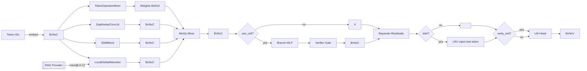
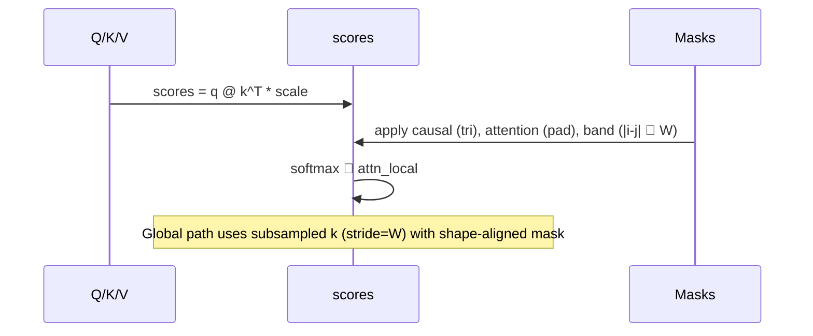

# Oumnix AI – Proprietary Non‑Transformer Architecture

[](https://github.com/qrv0/oumnix-minimal/actions)
[](https://codecov.io/gh/qrv0/oumnix-minimal)
[](#)


[](LICENSE)
[](#)
[](https://pytorch.org)
[](#)
[](#)
[](CONTRIBUTING.md)
[](CODE_OF_CONDUCT.md)
[](#)
[](#editions)
[](https://www.youtube.com/watch?v=pOzOnSE1IAY)

A generative AI architecture that is an alternative to Transformers, focused on efficiency, long‑term memory, and dynamic reasoning. This repository contains the full agent (CLI and Web), training pipelines (with a recommendation to use streaming training), and the memory, metacognition, and neurochemistry components.

See also: ARCHITECTURE.md for deep technical reference (shapes, masks, error contracts, performance).

Key architectural features
- Mixture‑of‑Operators per token: blends local/global attention, SSM, and convolution per time step.
- Bayesian Residuals (PFP – propagation of uncertainty) in residual connections.
- WEAVE (weight factorization) + micro‑LoRA on critical projections for efficiency.
- Islet Injection (on‑demand deltas – disabled during training for stability).
- Retrieval‑as‑Attention (embedded RAG) via FAISS episodic memory.
- Dynamic depth (context‑adaptive steps and composition via metacognition/neurochemistry).
- Oumnix Cell (superposition → local collapse) for discrete operator composition.

∞‑Window Memory
- Hot‑KV (VRAM): recent states on GPU.
- Warm‑KV (RAM): compression via Product Quantization (PQ) + Low‑Rank.
- Context tree + Teleport Attention for efficient contextual jumps.

Metacognition and Neurochemistry
- Metacognition: strategy selection, causal reasoning, analogy (see core/analogy_engine.py, core/causal_engine.py, core/metacognition.py).
- Advanced neurochemistry (neuro/advanced_chemistry.py): parameters modulated by DA/5‑HT/NE/ACh, altering temperature, depth, etc.

Mixed precision and FP8
- Optimized for RTX 4000 series (FP8 – E4M3/E5M2), with fallback to FP16/AMP.


## Editions

Advanced knobs and usage (flag-gated)
- Per-token operator mixing (MoOp) and regularization:
  - Python: `model = OumnixSimpleAI(vocab_size, use_moop=True, moop_temperature=0.8, moop_entropy_reg=0.0)`
- RAG-fused attention in LocalGlobalAttention:
  - Provider must return a tensor `[B, K, C]` (embedding space). Example:
    ```python
    from utils.rag_provider import SimpleRagProvider
    model = OumnixSimpleAI(vocab_size)
    rag = SimpleRagProvider(dim=model.embed.embedding_dim, topk=8)
    for layer in model.layers:
        att = layer[0]
        if hasattr(att, 'set_rag_provider'):
            att.use_rag = True
            att.set_rag_provider(lambda x: rag(x))
    ```
- Early exit:
  - `model = OumnixSimpleAI(vocab_size, early_exit=True, exit_threshold=1.0)`
- WEAVE wrappers (selected Linear layers):
  - `model = OumnixSimpleAI(vocab_size, use_weave=True)`
- Islet Injection (minimal LRU path):
  - `model = OumnixSimpleAI(vocab_size, use_islet_injection=True, islet_capacity=128)`
- Oumnix Cell v1 (branch + collapse):
  - `model = OumnixSimpleAI(vocab_size, use_cell=True, cell_threshold=0.5)`
- Auxiliary heads scaffold (temporal/identity):
  - `model = OumnixSimpleAI(vocab_size, use_aux_heads=True)`
- Bayesian Residuals (state uncertainty):
  - `model = OumnixSimpleAI(vocab_size, use_bayesian_residuals=True, residual_std=0.02)`
- Token Flow (no-KV light):
  - In LocalGlobalAttention: `enable_token_flow=True, token_flow_thresh=0.6`
- CLI env controls:
  - `OUMNIX_TEMPERATURE`, `OUMNIX_TOPK`, `OUMNIX_MAX_NEW_TOKENS`, `OUMNIX_USE_RAG` ("1" to enable rolling RAG)
- Web interface factory and optional controls:
  - `make_interface(temperature=None, top_k=50, max_new_tokens=16)`
  - `OUMNIX_WEB_CONTROLS=1` to enable sliders (temperature, top-k, max_new_tokens)
  - sliders persist to `.oumnix_web_settings.json` when controls UI is enabled
- Logging controls:
  - `OUMNIX_LOG_LEVEL` to set logging level (DEBUG, INFO, WARNING, ERROR, CRITICAL)


Note: This Simple Edition now includes flag-gated knobs for research:
- Optional per-token operator mixing (MoOp) in OumnixSimpleAI via use_moop=True.
- Optional RAG-fused attention in LocalGlobalAttention via use_rag and set_rag_provider (provider returns a [B, K, C] tensor to be projected into K/V pseudo-tokens).
- CLI environment controls: OUMNIX_TEMPERATURE, OUMNIX_TOPK, OUMNIX_MAX_NEW_TOKENS, OUMNIX_USE_RAG ("1"), OUMNIX_STOP_SEQUENCES (comma-separated), OUMNIX_METRICS_INTERVAL (int).
- Web factory: make_interface(temperature=None, top_k=50, max_new_tokens=16).


### Simple Edition (Open Source)
This repository. Includes core Oumnix features such as modular operators, Infinity-Window memory, adaptive parameter control, and basic metacognition. Designed for research accessibility and consumer GPUs.

### Advanced Edition (Not Open Source)
A proprietary system that extends Oumnix far beyond the Simple Edition.
It introduces advanced runtime adaptability, encrypted full-state persistence, multi-level regulation, and mechanisms for long-term autonomous operation.
This edition is not publicly released.


## Context

I’m fully aware of the non-Transformer architectures being explored today:

- RWKV — RNN+Transformer hybrid with state evolution
- Mamba / SSMs — selective state spaces, efficient long-sequence modeling
- RetNet — retention mechanism (Microsoft)
- Hyena — convolutional sequence modeling without attention
- Mega — sparse attention with recurrence
- HyperMixer — MLP token-mixing with hypernets
- Differential Transformer — stable attention via signal subtraction

All of these are valuable directions.
But Oumnix is not any of them.

## What Makes Oumnix Different

- Mixture-of-Operators (MoOp): per-token routing across operators (beyond MoE)
- Bayesian Residuals: uncertainty-aware residuals for stable flow
- WEAVE + micro-LoRA: weight factorization with adaptive deltas
- Islet Injection: low-rank hyper-deltas infrastructure present (disabled by default in training)
- Retrieval-as-Attention: retrieval as a native pathway
- Dynamic Depth: discrete Neural-ODE style depth control
- Oumnix Cell: hypothesis superposition → local collapse
- Infinity-Window: virtual infinite context memory (already available in the Simple Edition)

While others aim to replace attention or compress memory,
Oumnix explores neuro-inspired modularity, infinite-context memory, and operator-level adaptivity.


## Architecture Overview (ASCII + Mermaid)



### Attention masking (Mermaid)




```
                         +----------------------------------+
                         |          OumnixAI Wrapper        |
                         |  - Metacognition (basic)         |
                         |  - Neurochemistry modulation     |
User Text ──tokenize──▶  |  - Infinity-Window integration   |
                         +---------┬------------------------+
                                   | memory_vectors (RAG)
                                   v
+--------------------------------------------------------------------+
|                    OumnixMinimal (Simple Edition)                  |
|                                                                    |
|  Token Embedding + Positional Embedding                            |
|           │                                                        |
|           v                                                        |
|  ┌──────────────────────────────────────────────────────────────┐  |
|  |                OumnixMinimalBlock (repeated N)               |  |
|  |                                                              |  |
|  |  LayerNorm → TokenOperatorMixer (MoOp, flag)                 |  |
|  |            │                     │                           |  |
|  |            │                     ├─ Local/Global Attention   |  |
|  |            │                     │    (RAG via provider)     |  |
|  |            │                     │    (TokenFlow, flag)      |  |
|  |            └─────────────────────┤                           |  |
|  |                                  └─ SSM (state space block)  |  |
|  |                                                              |  |
|  |  Residual add → LayerNorm                                    |  |
|  |  Early-exit by entropy (flag)                                |  |
|  └──────────────────────────────────────────────────────────────┘  |
|           │                                                        |
|           v                                                        |
|        LayerNorm  →  LM Head  →  logits                            |
+--------------------------------------------------------------------+

Infinity‑Window Memory:
  - Hot‑KV (VRAM), Warm‑KV (RAM, PQ+Low‑Rank), context tree + teleport.
  - RAG provider returns [B, K, C] memory vectors, projected into K/V.      
```

## Beginners (Quickstart)


Demo video: 50M‑param model trained from loss ~8.0 to ~0.9 in ~13 minutes using this architecture — https://www.youtube.com/watch?v=pOzOnSE1IAY

1) Requirements
- Python 3.10+
- Optional CUDA (NVIDIA) – recommended for training
- Dependencies: `pip install -r requirements.txt`

2) Run the agent (chat)
- Terminal (CLI):
```
python main.py --ui cli
```
- Web interface (Gradio):
```
python main.py --ui web
```
Tips:
- To load an automatically saved checkpoint: just run `main.py` – it tries to detect `checkpo/`, `checkpoints_streaming/`, and `checkpoints/`.
- To force a specific checkpoint:
```
python main.py --checkpoint-path checkpoints/best_model.pt
```

3) Recommended training: Streaming
The streaming pipeline reads and tokenizes chunks directly from files in `datasets/`, reducing RAM/VRAM usage and enabling large datasets.
- Lightweight example (2–4 GB VRAM):
```
python train_streaming.py \
  --epochs 2 \
  --batch_size 2 \
  --chunk_size 500 \
  --max_length 256 \
  --use_amp \
  --log_interval 25 \
  --out_dir checkpoints_streaming
```
- On RTX 4000 GPUs, FP8 may be automatically detected; to force the flag in compatible environments:
```
python train_streaming.py --use_fp8
```
- To enable neurochemistry during streaming training:
```
python train_streaming.py --enable_neurochem
```

4) Expected data format
- Place your files in `datasets/` (accepted: .json, .jsonl, .txt)
- The reader supports JSON lines with keys `text` or `content`, lists, or conversation format under `conversations: [{role, content}]`.

5) Determinism
- Set `OUMNIX_DETERMINISTIC=1` to enable deterministic seeds in CLI/Web and training.
- Seeds are propagated to NumPy/Torch; PQ (FAISS KMeans) uses a fixed seed. GPU kernels may still differ slightly between runs.

6) Persistence flags
- `--save-full-state` / `--resume-full-state` and `--state-dir` / `--state-password` are available in `train.py` and `train_streaming.py`.
- Full state includes model weights and memory summaries; LifeFile supports password rotation and backups (`.ai_state/ai_state.life`).


## Advanced Users and Labs (controls)


A) Full agent runtime (main.py)

Snippets
- Enable MoOp with 3 operators and regularization:
  `model = OumnixSimpleAI(vocab_size=tokenizer.vocab_size, use_moop=True, moop_temperature=0.8)`
- Enable WEAVE on LoRA-wrapped projections:
  `model = OumnixSimpleAI(vocab_size=tokenizer.vocab_size, use_weave=True)`
- Enable Bayesian Residuals (deterministic) and stochastic variant:
  `model = OumnixSimpleAI(vocab_size=tokenizer.vocab_size, use_bayesian_residuals=True, residual_std=0.02)`
  `model = OumnixSimpleAI(vocab_size=tokenizer.vocab_size, use_bayesian_residuals=True, residual_std=0.02, residual_stochastic=True, residual_prob=0.5)`
- Enable Islet Injection with small LRU cache:
  `model = OumnixSimpleAI(vocab_size=tokenizer.vocab_size, use_islet_injection=True, islet_capacity=128)`
- Oumnix Cell v1 scaffold:
  `model = OumnixSimpleAI(vocab_size=tokenizer.vocab_size, use_cell=True, cell_threshold=0.5)`
- Auxiliary heads scaffold:
  `model = OumnixSimpleAI(vocab_size=tokenizer.vocab_size, use_aux_heads=True)`
- Token Flow and early exit:
  `attn = LocalGlobalAttention(dim=64, heads=4, local_window=8, enable_token_flow=True, token_flow_thresh=0.6)`
  `model = OumnixSimpleAI(vocab_size=tokenizer.vocab_size, early_exit=True, exit_threshold=0.8)`
- Web controls with persistence enabled:
  `OUMNIX_WEB_CONTROLS=1 python main.py --ui web`
- CLI stop sequences and throughput logging:
  `OUMNIX_STOP_SEQUENCES="\nEND,\nSTOP" OUMNIX_METRICS_INTERVAL=10 python main.py --ui cli`
Flags:
- `--ui [cli|web]` – UI. Default: `cli`.
- `--model-dim INT` – Model dimensionality. Default: 768.
- `--layers INT` – Number of layers. Default: 12.
- `--n-heads INT` – Attention heads. Default: 12.
- `--checkpoint-path PATH` – Checkpoint `.pt` path to load weights.
- `--align-config-from-checkpoint` – Align dim/layers/heads to checkpoint when loading.
- `--load-state` – Load previously saved complete state.
- `--state-dir DIR` – Encrypted state directory. Default: `.ai_state`.
- `--password STR` – Password for state encryption.
- `--no-neurochemistry` – Disable neurochemistry.
- `--consolidation-interval INT` – Consolidation interval in seconds.

B) Full training (train.py)
- Classic batch training that loads into RAM.
Flags:
- `--dim INT` (default 768)
- `--n_layers INT` (default 12)
- `--n_heads INT` (default 12)
- `--max_seq_len INT` (default 2048)
- `--epochs INT` (default 3)
- `--batch_size INT` (default 8)
- `--gradient_accumulation_steps INT` (default 4)
- `--lr FLOAT` (default 1e-4)
- `--weight_decay FLOAT` (default 0.01)
- `--max_grad_norm FLOAT` (default 1.0)
- `--use_amp` (mixed precision)
- `--num_workers INT` (default 2)
- `--log_interval INT` (default 100)
- `--out_dir DIR` (default checkpoints)

C) Simplified training (train_simple.py)
- Minimalist version for quick tests.
Flags:
- `--epochs INT` (default 2)
- `--batch_size INT` (default 4)
- `--lr FLOAT` (default 1e-4)
- `--dim INT` (default 256)
- `--n_layers INT` (default 4)
- `--n_heads INT` (default 4)
- `--use_amp`
- `--log_interval INT` (default 50)
- `--out_dir DIR` (default checkpoints_simple)
- `--max_samples INT` (default 2000)

D) Streaming training (train_streaming.py) – recommended
Flags:
- `--epochs INT` (default 2)
- `--batch_size INT` (default 2)
- `--lr FLOAT` (default 5e-5)
- `--dim INT` (default 256)
- `--n_layers INT` (default 4)
- `--n_heads INT` (default 4)
- `--chunk_size INT` (default 500)
- `--max_chunks INT` (default 100) – chunks per epoch (≤0 streams all)
- `--max_length INT` (default 256)
- `--use_amp` – mixed precision
- `--strip_tags` – remove short tags <...> and normalize spaces
- `--enable_neurochem` – enable neurochemistry during training
- `--use_fp8` – attempt FP8 (useful on RTX 4000 with support)
- `--log_interval INT` (default 25)
- `--save_every_steps INT` (default 10000) – incremental checkpoints
- `--out_dir DIR` (default checkpoints_streaming)
- `--resume` – (reserved; resume support)

E) Programmatic config (OumnixAIConfig)
Parameters (core/oumnix_ai.py):
- vocabulary/dimension/layers/heads: `vocab_size`, `model_dim`, `n_layers`, `n_heads`
- memory: `hot_kv_size`, `warm_kv_windows`, `context_tree_fanout`
- metacognition: `max_reasoning_steps`, `strategy_beam_size`
- neurochemistry: `use_neurochemistry`, `neuro_update_frequency`
- consolidation/“dreams”: `consolidation_interval`, `dream_duration`
- persistence/state: `auto_save_interval`, `state_dir`, `encryption_password`
- runtime: `max_sequence_length`, `batch_size`, `device`

Example:
```python
from core.oumnix_ai import OumnixAIConfig, create_oumnix_ai
from utils.tokenizer import tokenizer

config = OumnixAIConfig(
    vocab_size=tokenizer.vocab_size,
    model_dim=768,
    n_layers=12,
    n_heads=12,
    hot_kv_size=4096,
    use_neurochemistry=True,
    consolidation_interval=3600,
    state_dir='.ai_state'
)
ai = create_oumnix_ai(config)
ai.activate()
```

F) Checkpoints and state
- Trainers save `checkpoint_epoch_*.pt` and `best_model.pt` under `--out_dir`.
- `main.py` tries to auto‑discover checkpoints under: `checkpoints_streaming/`, `checkpoints/` (legacy `checkpo/` is still scanned).
- Complete state (model + memory + metacognition + neuro + config) is saved/restored via `PersistenceManager` and `--load-state`/`--state-dir`.

Episodic memory persistence
- The agent’s FAISS‑backed episodic memory is serialized inside the LifeFile as separate segments:
  - `episodic_meta` (JSON): dimension, normalization flag, metric (L2/IP), whether vectors are stored, and texts.
  - `episodic_vectors` (NumPy): stacked float32 vectors when `store_vectors=True`.
- On load, the vectors are re‑added to a fresh FAISS index using the stored meta. When `store_vectors=False`, only texts are restored.

G) Performance and VRAM (with live counters examples)
- Prefer `train_streaming.py` for large datasets and limited VRAM.
- Use `--use_amp` to reduce overhead; on RTX 4000 consider `--use_fp8` (or rely on automatic detection).
- Adjust `--chunk_size`, `--max_length`, and `--batch_size` based on your constraints.
- Trainers log performance metrics: tokens/s, ms/token, and VRAM usage snapshots.
- CLI can log generation throughput via `OUMNIX_METRICS_INTERVAL` (tokens per interval).

Live plotting example (Plotly):
```python
from utils.metrics import PerfTracker
import plotly.graph_objects as go

perf = PerfTracker(window=100)
# Simulate updates
data_tps, data_ms = [], []
for step in range(1, 501):
    tokens = 4096  # example tokens produced per interval
    seconds = 0.5  # example interval seconds
    perf.update(tokens, seconds)
    snap = perf.snapshot()
    data_tps.append(snap['tokens_per_sec'])
    data_ms.append(snap['ms_per_token'])

fig = go.Figure()
fig.add_trace(go.Scatter(y=data_tps, mode='lines', name='tokens/s'))
fig.add_trace(go.Scatter(y=data_ms, mode='lines', name='ms/token', yaxis='y2'))
fig.update_layout(
    title='Oumnix – Live Perf Counters',
    xaxis_title='Interval',
    yaxis=dict(title='tokens/s'),
    yaxis2=dict(title='ms/token', overlaying='y', side='right'),
)
fig.show()
```


H) Code layout (main folders)
- `core/`: minimal model (OumnixMinimal), AI wrapper, metacognition, loss, FP8 optimization.
- `memory/`: Infinity Window, advanced consolidator, persistence.
- `neuro/`: states and advanced chemistry.
- `ui/`: CLI/Web interfaces (simple and advanced versions).
- `utils/`: simple BPE tokenizer and tolerant dataset loader.

I) Notices and limits
- Some advanced mechanisms (Islet Injection, dynamic depth, Oumnix Cell collapse) are sensitive during training; Islet Injection is disabled by default while training.
- Embedded RAG depends on FAISS (CPU by default – see `requirements.txt`).

J) OMNX Exporter (metrics)
- Enable with `OUMNIX_OMNX=1` and optional `OUMNIX_OMNX_PORT`. Trainers expose tokens/s, ms/token, KV-hit and head-drop via `/metrics`.
- Example: `OUMNIX_OMNX=1 python train.py --use_amp` then scrape `http://localhost:9100/metrics`.

K) Infinity-Window Persistence Notes
- Warm windows are compressed using PQ (codebooks) and Low-Rank (SVD) with reconstruction error tracked per window.
- Metadata tracked includes `last_access`, `importance`, `compression_ratio`, and `recon_error` for eviction and diagnostics.


## License

This project uses the Business Source License 1.1 (BSL 1.1). See `LICENSE` for full terms. Licensor: qrv0. Change Date: 2028. The final open license (Change License) will be defined by the Licensor by the Change Date.


## Credits

- Author: qrv0

## Security & Secrets

- Set `OUMNIX_STATE_PASSWORD` and optionally `OUMNIX_STATE_SALT` in your environment to control LifeFile encryption.
- Password rotation is supported via PersistenceManager (also integrated in the agent and trainers). Salt defaults to a built‑in value if not provided; prefer setting your own salt in production.
